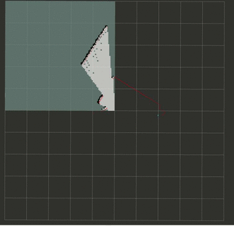

# ros_code
一些关于ros/C++从入门，进阶，到修仙的代码,部分代码也是为了以后的激光/视觉SLAM服务。代码多采用C++，虽然我水平有限，但我会尽量让自己的代码保持优雅。不定时更新

# 如何使用
在src文件夹外部catkin_make编译即可，生成的可执行程序在build文件夹下

## msg_communication
> ros发送/接收话题代码，接收话题时调用了回调函数，为了让代码有一点点不同，这里我加入了高并发，应用了多线程同时运行。

## grid_map
> 简单的发布nav_msgs::OccupancyGrid数据格式的栅格地图，可以在rviz下订阅/map话题并显示观看.代码是在小白学移动机器人发布的栅格地图代码上修改的.可以实时接收雷达数据并转换成栅格地图发布出来.使用的bag包放在了rosbag文件夹下

------------------------------------

# ros_code
Some about ros/C++ from entry, advanced, to the fairy code, part of the code is also for the future laser/visual SLAM service. Code mostly uses C++, although my level is limited, but I will try to keep their own code elegant. Irregular update

# How to use
Outside the SRC folder, catkin_make can be compiled. The generated executable program is in the build folder

## msg_communication
> Ros sends/receives the topic code. When receiving the topic, the callback function is called, and multiple threads are applied simultaneously

## grid_map
> Simple post of a raster map in Nav_MSgs ::OccupancyGrid data format that can be subscribed to/Map topics under RVIz and displayed for viewing. The code is modified on the raster map code released by the Xiaobaixue mobile robot. Radar data can be received in real time and converted into raster maps for publication. The bag package used is placed in the rosbag folder

